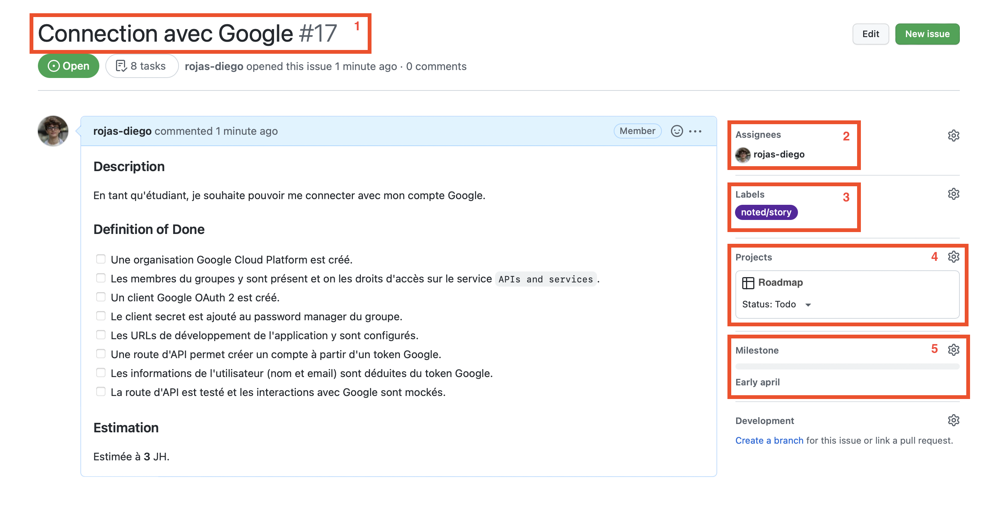
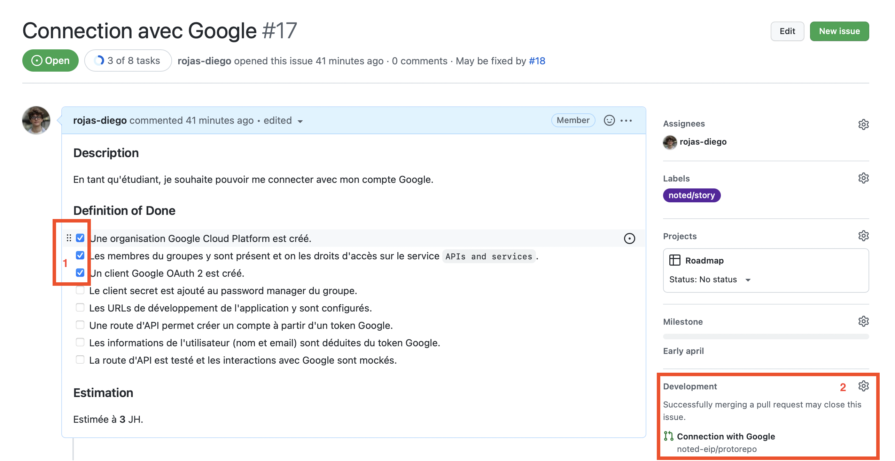
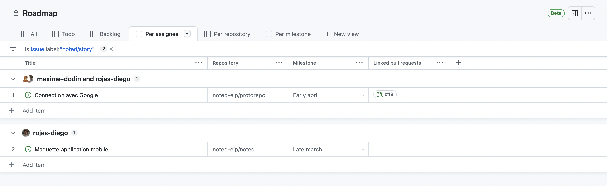

# Contributing Guidelines

This set of guidelines is common to all repositories in the Noted organization.

## Project Management

In order to frictionlessly roll out new features and maintain satisfactory productivity levels despite the distance, it's crucial that we organize ourselves and plan our work collectively.

> 💡 This specification aims to
> 
> - Transparently show what work is being done, by who, for when
> - Be simple and native to Github
> - Limit administrative work (maintaining todo-lists, updating statuses, etc)

### User Stories

This step is to be executed during the inter-sprint period. During this time, the PLD must be redacted and all the user-stories that will be completed during this sprint must be defined.

Each user-story must be defined as a Github issue. When creating an issue in any repository whithin the `noted-eip` organization, you should have the option to create a user-story issue.

After selecting the `User Story` template, fill in the information as indicated by the template. By the end, your user story should look something like the following.

Make sure your issue meets the following criteria:

1. There is a title which sums up the scope of this user-story.
2. The people who are going to work on this user-story during the sprint are assigned to the issue.
3. The issue has the `noted/user-story` label. This should be automatic.
4. The issue belongs to the `Roadmap` project. This is explained in the section on projects.
5. The issue is linked to a milestone. This is explained in the section on milestones.

## Pull Requests

As soon as you start working on an user-story, create a new branch, open a pull request and link it to your issue. If you're unsure how to do this, check out this [guide](https://docs.github.com/en/issues/tracking-your-work-with-issues/linking-a-pull-request-to-an-issue).

Here is what your issue should look like during development.

Make sure:

1. Tasks are checked-off as you complete them.
2. The issue is linked to its associated pull request.

As you're progressing, make sure to check-off completed tasks whithin the `Definition of Done` section whithin your issue.

### Milestones

Milestones define a due date for a given user-story. Each time you create a user-story issue, associate it with a milestone to set a due date. Milestones exist under the form `<Late|Early> <month>`. They are generated automatically, you just have to pick one.

### Projects

Github projects™️ allow you to visualize issues and pull requests from many repositories within an organization. We rely on a project called `Roadmap` to view all the user-stories for a given sprint.

If you have successfuly linked your `noted/user-story` issue to the project, you shouldn't have to perform any manual action on the project. You should be able to see all user-stories and their status.

You can filter stories by repository, assignee, todo, milestone and more.

### Weekly Meetings

During weekly meetings, we have access to the `Roadmap` Github project which gives us a high level view of our progress for the sprint. We can go over each item, check how many tasks were completed for this user-story, check the advancement through linked pull requests and determin if some user-stories have gone past their due dates. 
